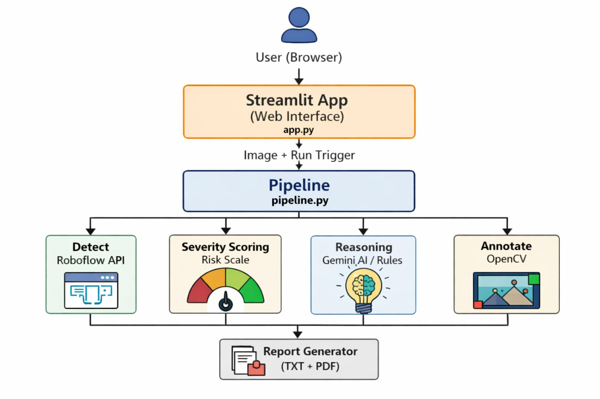

# Defect Inspection System

An AI-powered web application for automated surface defect detection, severity scoring, and root cause analysis of industrial components. Upload an image and get a full inspection report with annotated results in seconds.

---

## System Architecture
<p align="center">
  
</p>


### Pipeline Steps

```
Image Input
    |
    v
Step 1 - Detection  (steps/detection.py)
    Sends image to Roboflow serverless API
    Returns bounding boxes, class labels, confidence scores
    |
    v
Step 2 - Severity Scoring  (steps/severity.py)
    Scores each defect 0-100 using three weighted factors:
        Size (40%) + Location (35%) + Count (25%)
    Assigns level: Low / Medium / High
    |
    v
Step 3 - Root Cause Reasoning  (steps/reasoning.py)
    Primary:  Gemini AI generates causes, risks, actions
    Fallback: Rule-based lookup if no API key is set
    |
    v
Step 4 - Annotation  (steps/annotation.py)
    Draws color-coded bounding boxes on the image
    Red = High, Orange = Medium, Green = Low
    |
    v
Step 5 - Report  (steps/report.py)
    Generates downloadable TXT and PDF inspection report
    Includes final verdict: PASS / WARNING / FAIL
```

---

## Features

- Detects surface defects (cracks, scratches, rust, dents, etc.) using a custom-trained Roboflow model
- Scores each defect by size, position on the surface, and total defect count
- Uses Google Gemini 2.5 Flash for intelligent root cause analysis
- Falls back to rule-based reasoning automatically when no Gemini key is provided
- Annotates the uploaded image with color-coded bounding boxes and labels
- Issues a final inspection verdict: PASS, WARNING, or FAIL
- Exports the full inspection report as a plain-text file or a styled PDF
- Fully containerized with Docker for easy deployment anywhere

---

## Tech Stack

| Layer              | Technology                     |
|--------------------|-------------------------------|
| Frontend           | Streamlit                      |
| Detection Model    | Roboflow Serverless API        |
| AI Reasoning       | Google Gemini 2.5 Flash        |
| Image Processing   | OpenCV, Pillow                 |
| PDF Generation     | ReportLab                      |
| Containerization   | Docker, Docker Compose         |
| Language           | Python 3.11                    |

---

## Project Structure

```
defectReport/
├── app.py                  # Streamlit web interface
├── pipeline.py             # Central import hub for all steps
├── steps/
│   ├── detection.py        # Roboflow API integration
│   ├── severity.py         # Defect scoring logic
│   ├── reasoning.py        # Gemini AI + rule-based fallback
│   ├── annotation.py       # OpenCV image annotation
│   └── report.py           # TXT and PDF report generation
├── Dockerfile
├── docker-compose.yml
├── requirements.txt
└── .env.example
```

---

## Local Setup

**1. Clone the repository**

```bash
git clone https://github.com/Thamizh06/Defect-Generation.git
cd Defect-Generation
```

**2. Create a virtual environment**

```bash
python -m venv .venv
source .venv/bin/activate
```

**3. Install dependencies**

```bash
pip install -r requirements.txt
```

**4. Set up environment variables**

```bash
cp .env.example .env
```

Edit `.env` and fill in your API keys:

```
ROBOFLOW_API_KEY=your_roboflow_key_here
GEMINI_API_KEY=your_gemini_key_here
```

**5. Run the app**

```bash
streamlit run app.py
```

Open `http://localhost:8501` in your browser.

---

## Docker Setup

**Run with Docker Compose (recommended)**

```bash
cp .env.example .env    # fill in your API keys first
docker compose up
```

**Or pull the pre-built image directly**

```bash
docker pull thamizhamudhan06/defect-inspector:latest
docker run -p 8501:8501 --env-file .env thamizhamudhan06/defect-inspector:latest
```

Open `http://localhost:8501` in your browser

---

## API Keys

| Key                 | Where to get it                                     |
|---------------------|-----------------------------------------------------|
| `ROBOFLOW_API_KEY`  | https://app.roboflow.com — Account Settings         |
| `GEMINI_API_KEY`    | https://aistudio.google.com/app/apikey              |

The app works without a Gemini key. It falls back to rule-based root cause analysis automatically.

---

## Severity Scoring Formula

Each defect is scored from 0 to 100:

```
score = (size_score x 0.40) + (location_score x 0.35) + (count_score x 0.25)
```

| Factor   | Weight | Logic                                              |
|----------|--------|----------------------------------------------------|
| Size     | 40%    | Defect area as a percentage of the total image     |
| Location | 35%    | Distance from image center (center scores higher)  |
| Count    | 25%    | Total number of defects detected in the image      |

Score ranges: Low (0-39), Medium (40-69), High (70-100)


